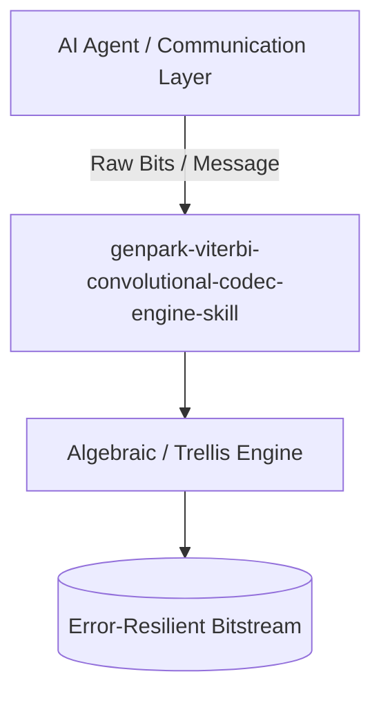

# genpark-viterbi-convolutional-codec-engine-skill

[](https://github.com/alphaparkinc/genpark-viterbi-convolutional-codec-engine-skill/actions)
[](https://opensource.org/licenses/MIT)
[](https://www.python.org/downloads/)

> Convolutional encoder and Viterbi trellis dynamic programming maximum-likelihood path decoder for noisy communication channels.

## Architecture



## Features
- Pure standard library Python implementation with strictly zero pip dependencies.
- Production-grade information theory algorithms (Galois field arithmetic, Tanner graphs, Viterbi trellis).
- Native Model Context Protocol (MCP) server support for AI agent orchestration.

## Installation

```bash
git clone https://github.com/alphaparkinc/genpark-viterbi-convolutional-codec-engine-skill.git
cd genpark-viterbi-convolutional-codec-engine-skill
```

## Quickstart

```bash
python example_usage.py
```
